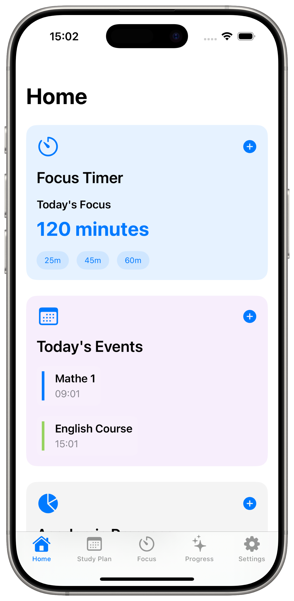
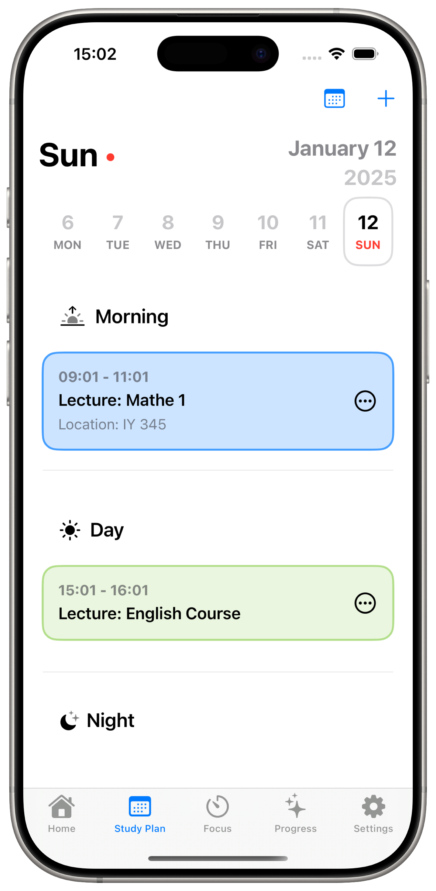
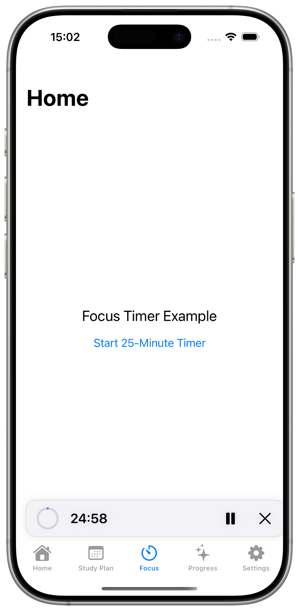
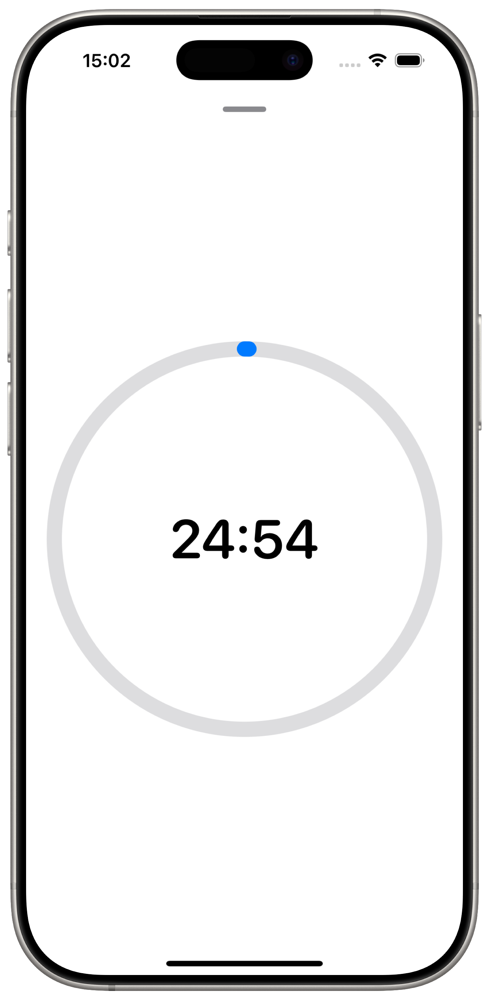
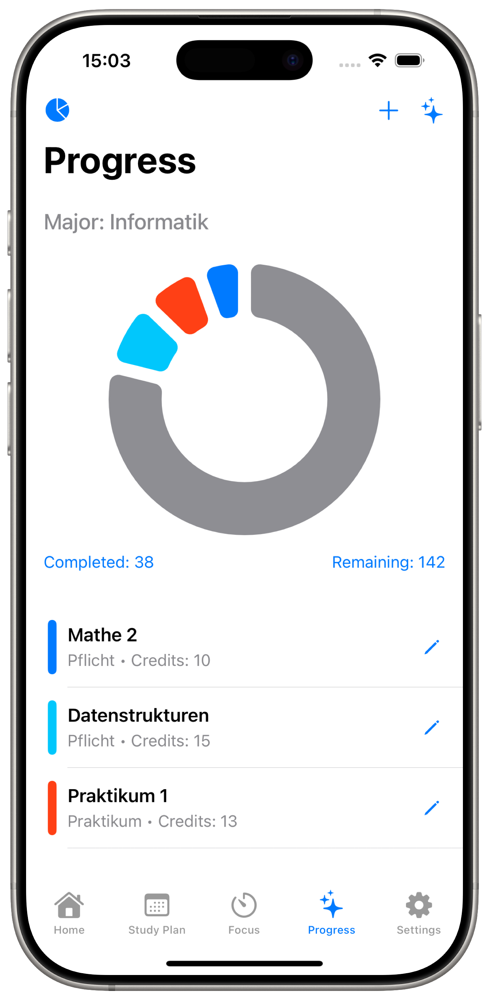

# Study Planner App

An iOS app designed to help students manage their studies efficiently. This app combines event tracking, focus timer functionality, and progress visualization to improve productivity and time management.

---

## Features

### 1. **Home Dashboard**
   - Displays daily focus timer and its progress.
   - Shows today's events in a clean, concise interface.

### 2. **Focus Timer**
   - Includes preset timers (25 min, 45 min, 60 min).
   - Tracks focus sessions and allows pauses/resets.

### 3. **Progress Tracking**
   - Visualize your progress using interactive charts.
   - Track completed and remaining credits based on your study plan.
   - Support for different types of courses: Pflicht, Wahlpflicht, Praktikum.

### 4. **Study Plan**
   - Organize your lectures and events by time and day.
   - Easy to navigate calendar for planning study sessions.

### 5. **Settings**
   - Customize the app according to your preferences (to be implemented).

---

## Screenshots

### Home


### Focus Timer



### Study Plan


### Progress Tracker


## Installation

1. Clone this repository:
   ```bash
   git clone https://github.com/your-username/study-planner.git

	2.	Open the project in Xcode.
	3.	Build and run the app on a simulator or connected device.

Technologies Used
	•	Swift/SwiftUI for app development.
	•	Charts for progress visualization.
	•	Xcode for the development environment.
 	•	CoreData

Future Improvements
	•	Add customizable focus timer settings.
	•	Integrate notifications for reminders.
	•	Provide dark mode support.
	•	Sync data across devices using iCloud.
 	•	Timer full implementation 

Contribution

Contributions are welcome! Please fork the repository, make your changes, and submit a pull request.

License

This project is licensed under the MIT License. See the LICENSE file for more details.

Acknowledgments
	•	Inspiration from productivity tools like Notion and Todoist.
	•	Open-source libraries for their support in improving the app’s UI/UX.

